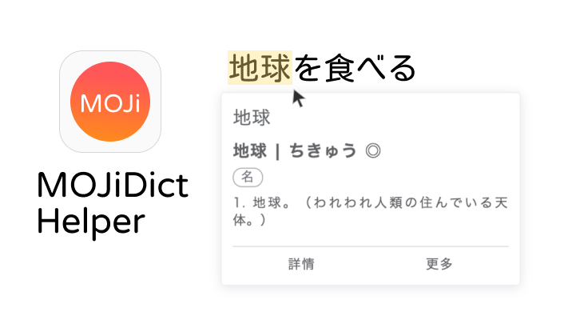
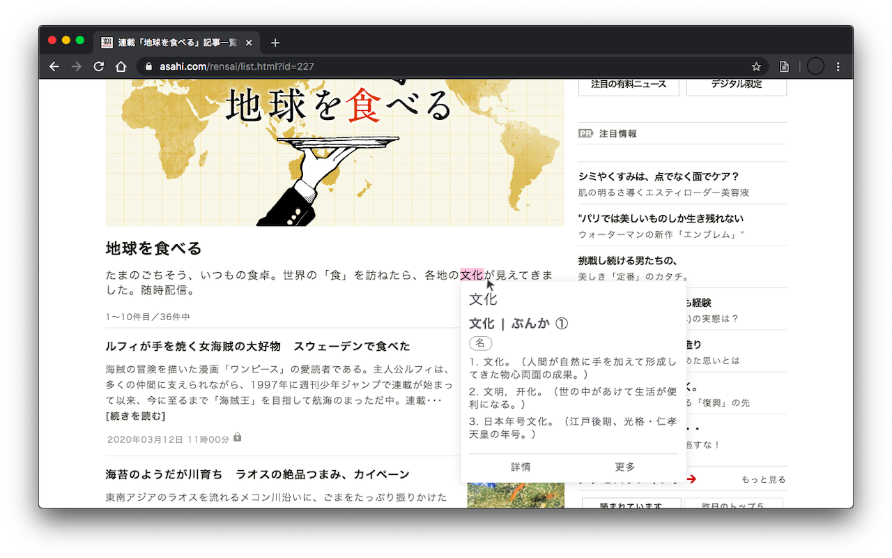

# MOJiDict Helper - 日文字典的瀏覽器擴充功能

只要輕點兩下網頁中的任意文字，MOJiDict Helper 就會跳出小視窗搜尋單字，讓你快速記憶查詢日文單字！

背後利用了「MOJi辞書」mojidict.com 的 API。

目前為 Google Chrome 限定的瀏覽器擴充功能，Chromium 系的 Opera 和 Edge 瀏覽器也都能使用。

## Screenshots

## Credits

- [MOJi辞書](https://www.mojidict.com) 的介面和 App 都漂亮好用，我個人是有付費解鎖，推薦給各位
- 擴充功能圖示和宣傳圖，都使用了今天 (2020/3/14) 剛釋出熱騰騰的「[jf open 粉圓字型](https://justfont.com/huninn/)」來製作，這字體實在太可愛啦！

## LICENSE

MIT
